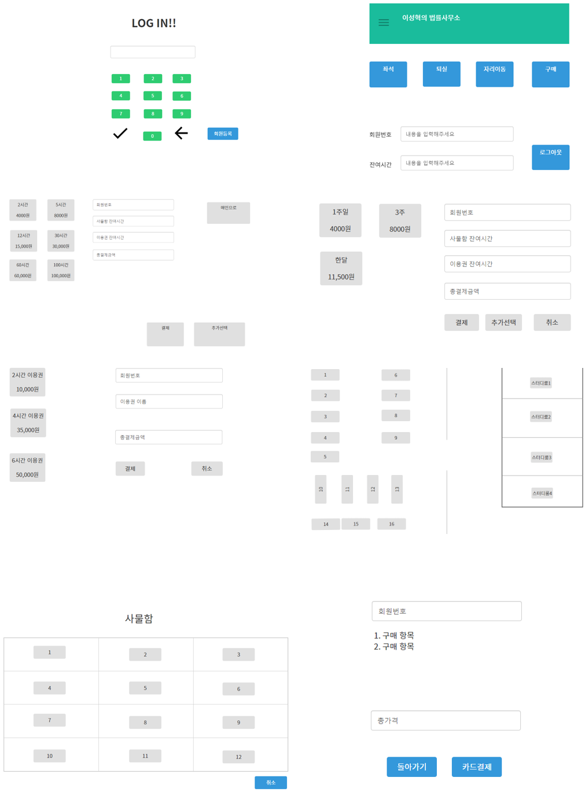
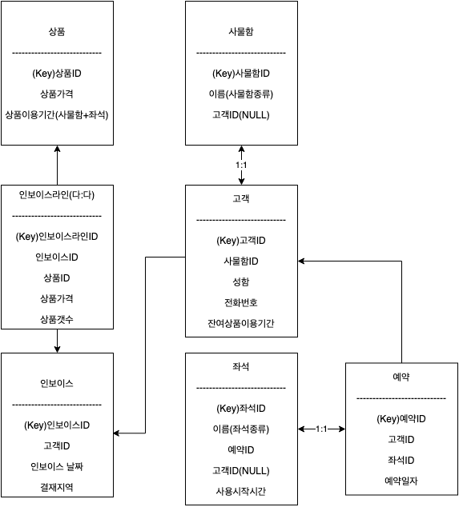
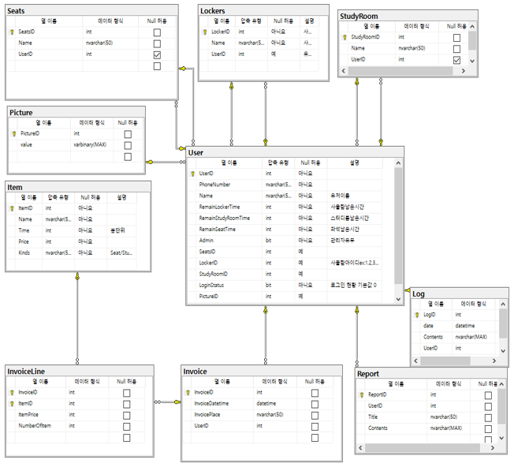
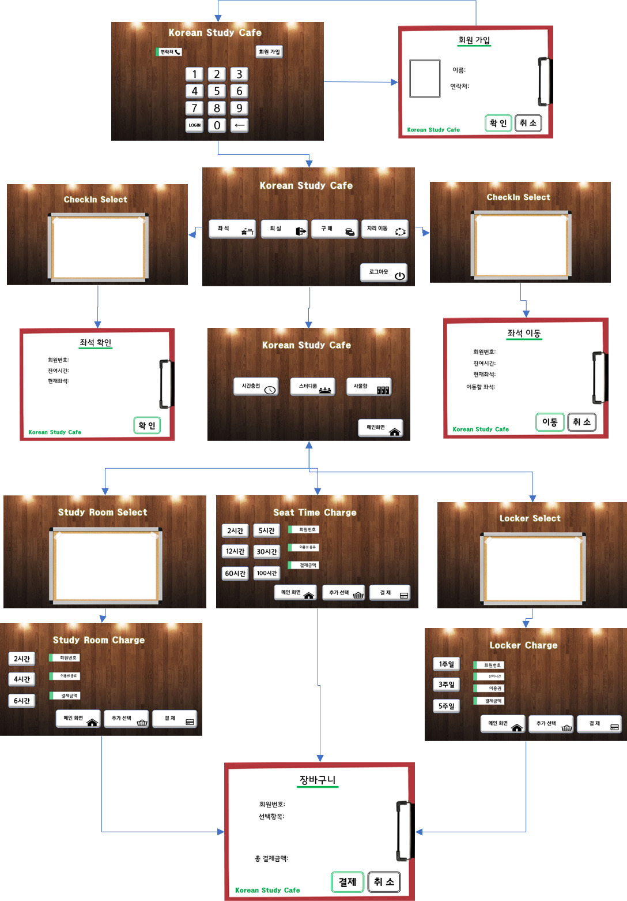

미니 프로젝트 Korean StudyCafe
===========================

《2020-11-23 ~ 2020-11-29》

____


## ■ 참여인원

>### 구성원
>
>| 구성원 | 역할 |
>| :----: | :--: |
>| 강동진 |      |
>| 이대균 |      |
>| 이성혁 |      |
>| 이민균 |      |
>| 김성동 |      |


## ■ 개요

국가기술컨소시움 교육간 배운 기술을 실습하고자교육생 5명이 팀을 이뤄 미니 프로젝트를 진행함. 한국형 독서실인 스터디 카페 관리시스템을 키오스크 기기를 기반으로 하여 창의적인 기술을 추가하여 개발하는 것이 목표. 


## ■ 사용언어 및 프로그램 


>| 언어/프로그램               | 목적                        |
>| --------------------------- | --------------------------- |
>| C# 8.0(WinForm) | 구현 언어                   |
>| .Net FrameWork 4.8         |  프레임워크                      |
>|  EntitiyFrameWork 6.2        |         프레임워크               |
>| Visual Studio Community 2019 v16.8 | IDE                         |
>| GitHub, GithubDesktop       | 팀간 프로젝트 공유          |
>| MS-SSMS v18.6                       | 데이터 베이스               |
>| KaKaoOven                   | UI 드래프트 제작            |
>| Drawing.io                  | 알고리즘, 데이터베이스 도식 |
>| PowerPoint                  | UI 이미지 제작              |
>| OpenCV             | 영상처리 라이브러리              |


## ■ 프로그램 드래프트 



## ■ **프로그램** **윈폼** 진행도


>


## ■ **프로그램** **윈폼** 진행도




## ■ 데이터베이스 다이어그램

'

> '

## ■ UI 다이어그램



## ■ 코드개발과정


### 타이머를 놓았을때 먹통이되는 문제

#### 증상

- 남은 시간을 줄이기 위해 타이머를 부모폼인 로그인폼에 뒀는데 로그인을 하는 순간부터 폼이 동작을 하지않음

#### 원인

- 타이머와 반복문이 계속해서 동작을 해 메모리가 부족한 것으로 추측은 했지만 정확한 원인을 파악하진 못함

#### 결과

- TimeChecker라는 콘솔 프로젝트를 새로 만들어서 디버그 후 .exe파일을 작업 스케줄러를 사용해 1분간격으로 실행시킴
- 1분마다 콘솔창이 화면에 나타나는 불편함이 있지만 아직 해결하진 못함
  [작업스케줄러 사진]


### 데이터를 다른폼에서 넘겨 받을때 생성자를 이용해 계속 넘겨받아야 하는 번거로움이 존재

#### 증상

- 로그인 한 유저의 데이터를 넘겨 받기 위해서는 생성자를 폼마다 생성해야 하는 중복코드가 만들어짐

#### 원인

- 다른폼에서 사용한 데이터를 사용하기 위해서는 생성한 데이터를 넘겨 준 후 생성자를 이용해 받아 사용해야함


#### 결과

- 로그인 한 유저의 데이터를 계속 사용할 수 있도록 싱글톤으로 클래스를 생성

---

```csharp
#region singleton
    private Credential()
    {
    }

    private static Credential _instance;

    public static Credential Instance
    {
        get
        {
            if (_instance == null)
                _instance = new Credential();

            return _instance;
        }
    }
#endregion

    public string PhoneNumber
    {
        get
        {
            return User.PhoneNumber;
        }
    }

    public User User { get; set; }
```


### 카메라 실행시 OpenCV 라이브러리를 실행할 수 없는 문제

#### 증상

- 빌드는 오류 없이 가능하지만 카메라를 실행하면 등록되지 않은 디바이스 오류가 발생하고 실행할 수 없음

#### 원인

- opencv 설치시 x64 플랫폼이 기본값으로 설정되어있어 정상 실행이 되지않음

#### 결과

- 구성관리자에서 x64 플랫폼으로 수정후 실행하는 방법으로 사용하다가 Nuget 패키지에서 AnyCPU 버전으로 다운받아 사용함
- 버전을 바꾼 후 실행은 가능하나 플랫폼 차이를 정확하게 이해하지는 못함 


# sql창에 이미지를 넣었을때 크기 변화가 안되는 문제

### 증상
- #### 창을 늘렸을때 sql창에 넣었던 이미지가 커지지않음

### 원인
- 각 이미지에다가 도킹을 하지않아 이미지의 변화가 없다고 판단했다

### 결과
- #### 각 이미지에 TableLayouPanel을 이용해 창의 크기에 맞게 설정이 되었다