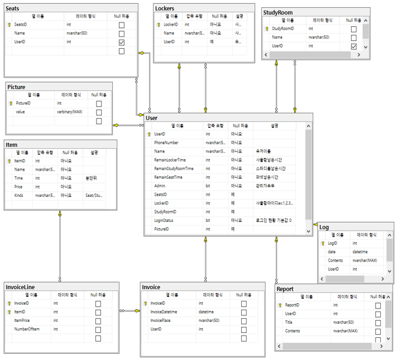
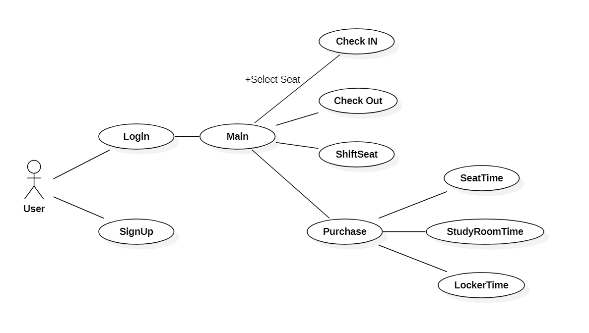
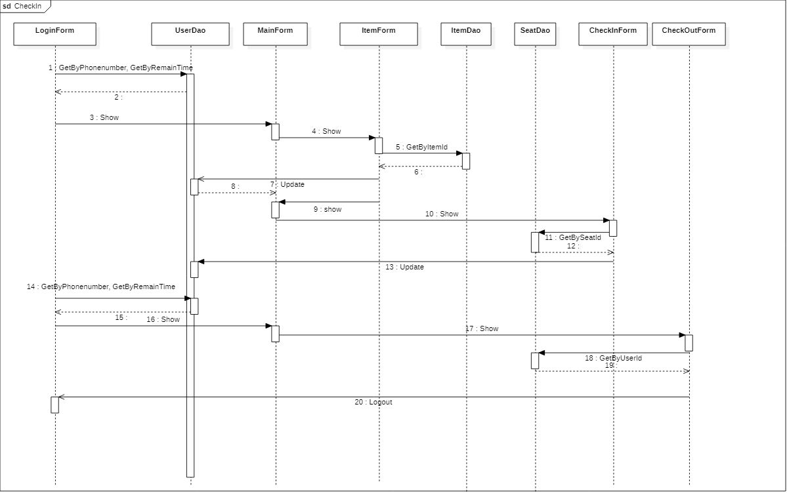
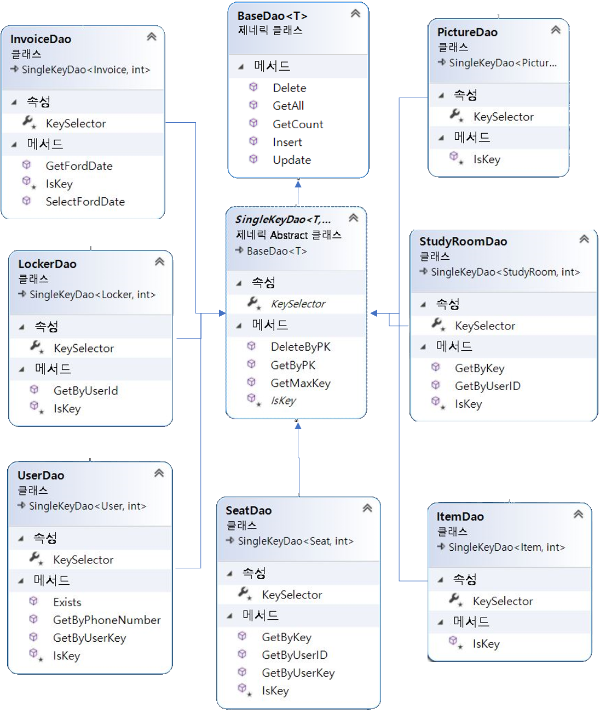
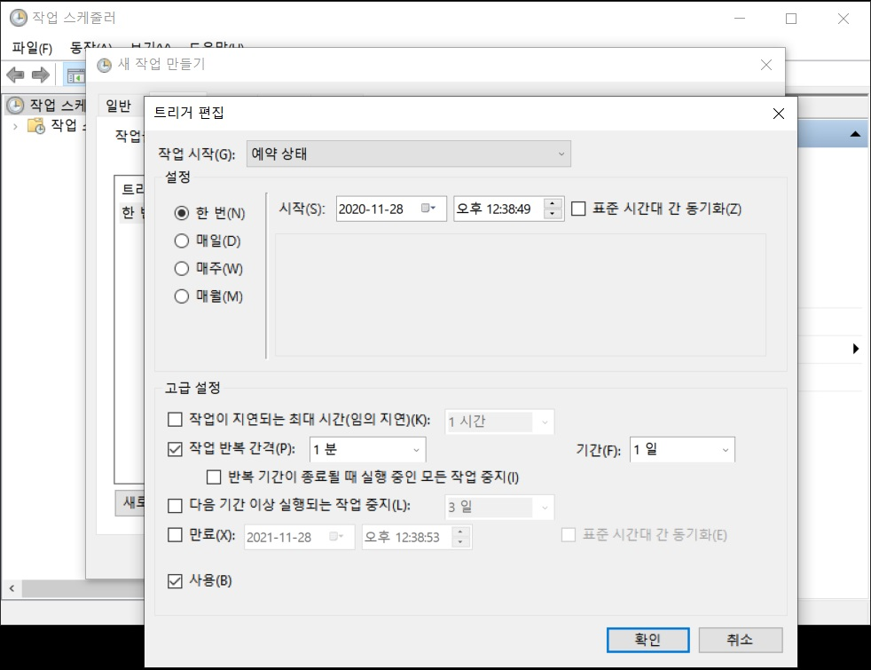
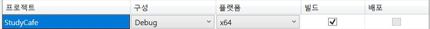

미니 프로젝트 Korean StudyCafe
===========================

《2020-11-23 ~ 2020-11-29》

## ■ 참여인원

>### 구성원
>
>| 구성원 | 역할 |
>| :----: | :--: |
>| 강동진 |      |
>| 이대균 |      |
>| 이성혁 |      |
>| 이민균 |      |
>| 김성동 |      |


## ■ 개요

 한국형 독서실인 스터디 카페 관리시스템을 키오스크 기기를 기반으로 하여 창의적인 기술을 추가하여 개발하는 것이 목표. 

## ■ 주요 기능
### 1. 좌석 기능
- 시간 충전 : 고객은 결제를 통해 좌석 이용가능 시간 충전이 가능하다. 결제된 시간은 좌석 선택할 시에 1분 간격으로 소모되고 0분에 도달시에 자동 퇴실 된다.
- 좌석 선택 : 고객은 잔여 좌석 이용가능 시간이 있을때 현재 비어있는 좌석을 이용 할 수 있다.
- 좌석 이동 : 고객은 좌석을 이용중일때 언제든지 현재 좌석을 반납하고 비어있는 좌석을 이용 할 수 있다.
- 퇴실 : 고객은 좌석을 이용중일때 언제든지 좌석을 반납하고 퇴실 할 수 있다.

### 2. 스터디룸/라커 기능
- 스터디룸 결제 : 고객은 비어있는 스터디룸이 있을때 해당 조건의 스터디룸과 시간을 선택하고 결제하여 이용할 수 있다. 
- 스터디룸 퇴실 : 고객은 스터디룸을 이용중일때 언제든지 현재 스터디룸을 반납하고 퇴실 할 수 있다. 퇴실 할 시 잔여 시간은 0분 으로 업데이트 된다.
- 라커 결제 : 고객은 비어있는 라커가 있을때 해당 조건의 라커와 시간을 선택하고 결제하여 이용할 수 있다.

### 3. 기타 기능
- 회원 등록 : 각각을 고객을 구분하기 위한 회원 등록 기능 이다. 전화번호를 입력 받고 캠을 통해 사진을 즉석해서 촬영해서 데이터 베이스에 저장한다.
- 장바구니 : 각각의 상품을 모아 한번에 구매 할 수 있다.

## ■ 사용 기술 

### 언어
- C# 8.0

### 프레임워크
- .Net FrameWork 4.8
- Entitiy FrameWork 6.2
- WinForm

### 데이터베이스
- MSSQL Server 2019

### 기타 개발환경
- Microsoft Visual Studio Community 2019 v16.8

### 라이브러리
- OpenCV (영상 처리 라이브러리)

## ■ 데이터베이스 다이어그램


## ■ 유즈케이스 다이어그램

## ■ 시퀀스 다이어그램

## ■ 클래스 다이어그램


## ■ 코드 문제점 해결


### 타이머를 놓았을때 먹통이되는 문제

#### 증상

- 남은 시간을 줄이기 위해 타이머를 부모폼인 로그인폼에 뒀는데 로그인을 하는 순간부터 폼이 동작을 하지않음

#### 원인

- 타이머와 반복문이 계속해서 동작을 해 메모리가 부족한 것으로 추측은 했지만 정확한 원인을 파악하진 못함

#### 결과

- TimeChecker라는 콘솔 프로젝트를 새로 만들어서 디버그 후 .exe파일을 작업 스케줄러를 사용해 1분간격으로 실행시킴
- 1분마다 콘솔창이 화면에 나타나는 불편함이 있지만 아직 해결하진 못함
  ####
  
  


### 데이터를 다른폼에서 넘겨 받을때 생성자를 이용해 계속 넘겨받아야 하는 번거로움이 존재

#### 증상

- 로그인 한 유저의 데이터를 넘겨 받기 위해서는 생성자를 폼마다 생성해야 하는 중복코드가 만들어짐

#### 원인

- 다른폼에서 사용한 데이터를 사용하기 위해서는 생성한 데이터를 넘겨 준 후 생성자를 이용해 받아 사용해야함


#### 결과

- 로그인 한 유저의 데이터를 계속 사용할 수 있도록 싱글톤으로 클래스를 생성

---

```csharp
#region singleton
    private Credential()
    {
    }

    private static Credential _instance;

    public static Credential Instance
    {
        get
        {
            if (_instance == null)
                _instance = new Credential();

            return _instance;
        }
    }
#endregion

    public string PhoneNumber
    {
        get
        {
            return User.PhoneNumber;
        }
    }

    public User User { get; set; }
```


### 카메라 실행시 OpenCV 라이브러리를 실행할 수 없는 문제

#### 증상

- 빌드는 오류 없이 가능하지만 카메라를 실행하면 등록되지 않은 디바이스 오류가 발생하고 실행할 수 없음

#### 원인

- opencv 설치시 x64 플랫폼이 기본값으로 설정되어있어 정상 실행이 되지않음

#### 결과

- 구성관리자에서 x64 플랫폼으로 수정후 실행하는 방법으로 사용하다가 Nuget 패키지에서 AnyCPU 버전으로 다운받아 사용함
- 버전을 바꾼 후 실행은 가능하나 플랫폼 차이를 정확하게 이해하지는 못함 



### sql창에 이미지를 넣었을때 크기 변화가 안되는 문제증상


- 창을 늘렸을때 sql창에 넣었던 이미지가 커지지않음

#### 원인

- 각 이미지에다가 도킹을 하지않아 이미지의 변화가 없다고 판단했음

#### 결과

- 각 이미지에 TableLayouPanel을 이용해 창의 크기에 맞게 설정이 되었음

---
### 좌석버튼을 눌렸을때 데이터가 다음 폼으로 전달이 안되는 현상 

#### 증상
- 좌석 버튼을 눌르고 입실버튼을 누르면 좌석확인폼, 스터디룸좌석 확인폼, 사물함번호 확인폼
등에 User에 대한 데이터가 넘어가지 않음.

#### 원인

-  Singleton으로 만든 Credencial의 UserId 만으로 User가 현재 좌석이 있는지 확인할수가 없었음.


#### 결과 
- UserForm에 CheckInStatus 를 bool 타입으로 만들어 현재 좌석이 있는지 없는지를 확인했고
  현재가지고 있는 좌석이 없다면 SeatForm 에 UserId를 업데이트 하게 했음.
---
```csharp
        private void btnCheckIn_Click(object sender, EventArgs e)
        {
            int userCredential = Credential.Instance.User.UserID;
            int userId = Dao.User.GetByUserKey(userCredential);

            User user = Dao.User.GetByPK(userId);
            user.CheckInStatus = true;
            Dao.User.Update(user);

            Seat seat = Dao.Seat.GetByPK(int.Parse(_seatNumber));
            seat.UserID = userCredential;
            Dao.Seat.Update(seat);

            DialogResult = DialogResult.OK;
            Close();
        }
```

---
### 데이터베이스에서 SeatForm에 UserId를 UserForm에 SeatId 를 집어고 서로가 Primary Key의 관계가 지어졌을때 데이터 오류가 남
    
#### 증상
- 프로그램을 돌렸을때 데이터의 무한순환이 발생함
#### 원인
- 서로 다른 Form에 Primary Key 가 들어있는 관계가 지어졌었음

#### 결과
- SeatForm 에만 UserId를 집어넣어 무한순환을 끊어 버림. 각각의 Form에 필요한 데이터라고 생각했지만 데이터가 한곳에만 있어도 서로 작동 하는것도 문제가 없음. 

---
### PaymentControl이 들어간 Form에서 DateGridVew에 데이터 삽입이 안되는 문제

#### 증상
- 디버깅시 UserControl에 데이터는 들어가지만 DateGridVew에 표시가 되지 않음. 

#### 원인
- UserControl에 있는 Add 함수에 ResetBindings()를 해주지 않아 데이터를 출력하지 못함. 

#### 결과
- PaymentControl에 Add 함수안에 ResetBindings(false)를 추가해 출력함.
---
```csharp
    public partial class PaymentControl : UserControl
    {
        public PaymentControl()
        {
            InitializeComponent();
        }

        protected override void OnLoad(EventArgs e)
        {
            base.OnLoad(e);
            bdsItem.DataSource = _items;
        }
        private List<Item> _items = new List<Item>();
        
        public void AddItem(Item item)
        {
            
            _items.Add(item);

            bdsItem.ResetBindings(false);
         
            txbTotalPrice.Text = _items.Select(x => x.Price).Sum().ToString();
        }

    }
 ```

### 로그인 버튼을 눌렀을때 잠깐의 멈춤현상 발생 문제

#### 증상 
- 약간의 멈춤 현상은 발생하지만 시간이 지났을때 정상적으로 작동됌

#### 원인
- 많은 유저들이 등록 되어있고 로그인 할 때 로그인 할 번호를 데이터 에서 
 하나하나 비교를 하기 때문에 
 데이터 정보를 가져오는 작업에 시간이 걸려 해당 폼에서는 멈춤현상이 발생함

#### 결과
- backgroundWork를 사용하여 Thread를 작동시킴 따라서 데이터 정보를 가져오는 작업 중에도  해당폼은 멈춤현상 없이 작동이 됌
- 마우스 커서에 동작버튼을 집어넣어 데이터를 불러 오고 있다는 표시를 했음
- 다른 폼에서도 데이터를 불러오는 메서드는 모두 backgroundWork로 수정함


---
```csharp
        private void btnLogIn_Click(object sender, EventArgs e)
        {
            Cursor = Cursors.WaitCursor;
    
            bgwLogin.RunWorkerAsync();
        }

        private void backgroundWorker1_DoWork(object sender, DoWorkEventArgs e)
        {
            User user = Dao.User.GetByPhoneNumber(txbUserPhoneNumber.Text);

            if (user != null)
            {
                Credential.Instance.User = user;
            }

            e.Result = user;
        }

        private void backgroundWorker1_RunWorkerCompleted(object sender, RunWorkerCompletedEventArgs e)
        {
            Cursor = Cursors.Arrow;
            User user = (User)e.Result;

            if (user != null)
            {
                MainForm mainform = new MainForm();
                mainform.ShowDialog();
                txbUserPhoneNumber.Text = "010";
            }

            else
            {
                txbUserPhoneNumber.Text = "010";
                MessageBox.Show("존재하지않는 회원입니다");
            }
        }
```

